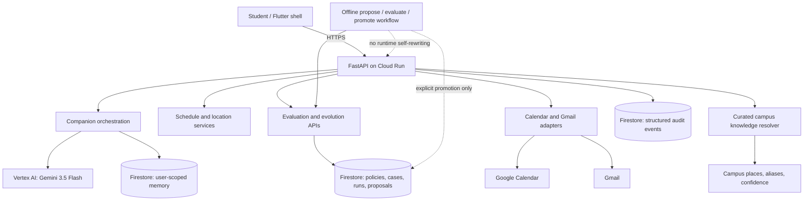

# Life Autopilot Agentic architecture

User memory and global policy evolution are separate Firestore areas. Gemini
provides contextual synthesis; deterministic code controls timing, schemas,
safety gates, and side effects. Routes/Places use APIs when configured and a
labelled fallback otherwise.
